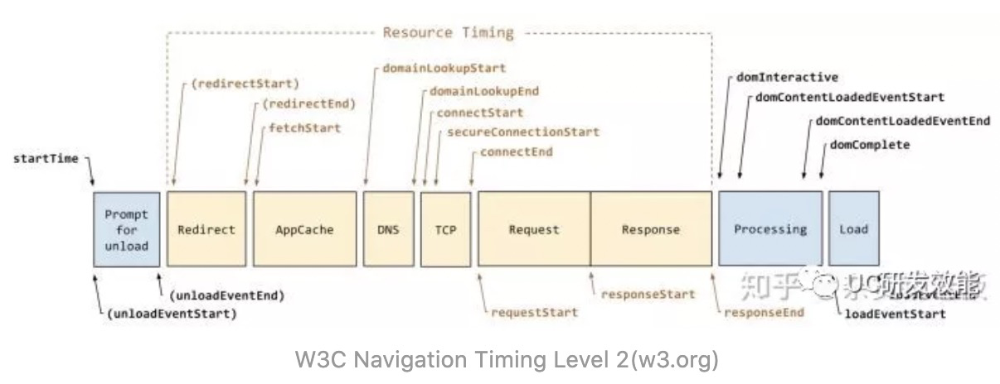
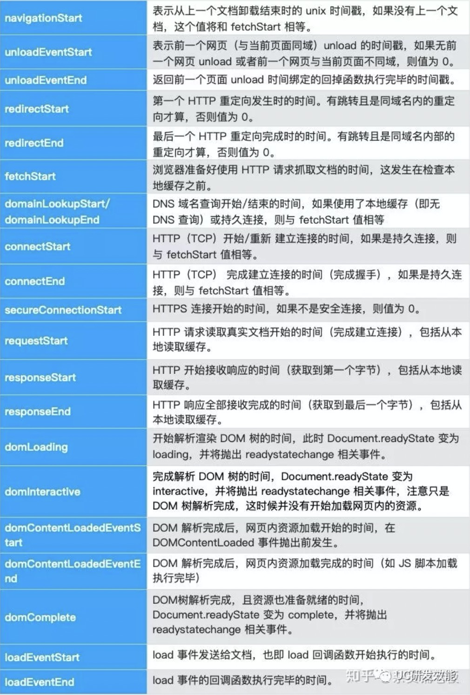
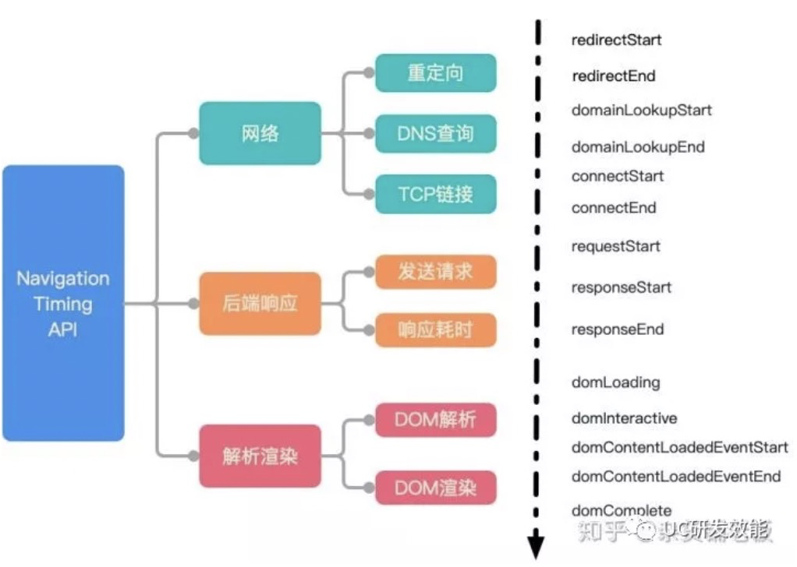
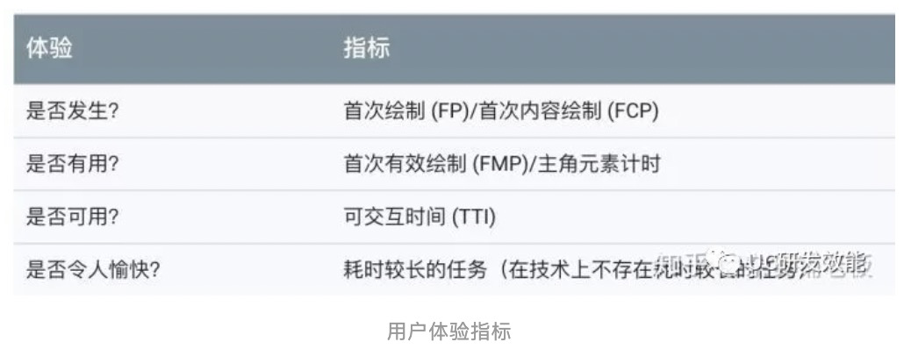

前端页面性能是一个非常核心的用户体验指标。主要采用的是Navigation Timing API以及sendBeacon等方法。

## 理解Navigation Timing API的性能指标

为了帮助开发者更好地衡量和改进前端页面性能，W3C性能小组引入了 Navigation Timing API ，实现了自动、精准的页面性能打点；开发者可以通过 window.performance 属性获取。

+ performance.timing 接口（定义了从 navigationStart 至 loadEventEnd 的 21 个只读属性）
+ performance.navigation（定义了当前文档的导航信息，比如是重载还是向前向后等）

下图是W3C第一版的 Navigation Timing 的处理模型。从当前浏览器窗口卸载旧页面开始，到新页面加载完成，整个过程一共被切分为 9 个小块：提示卸载旧文档、重定向/卸载、应用缓存、DNS 解析、TCP 握手、HTTP 请求处理、HTTP 响应处理、DOM 处理、文档装载完成。每个小块的首尾、中间做事件分界，取 Unix 时间戳，两两事件之间计算时间差，从而获取中间过程的耗时（精确到毫秒级别）。


上图是 Level 1 的规范，2012 年底进入候选建议阶段，至今仍在日常使用中；但是在W3C的议程上，它已经功成身退，让位给了精度更高，功能更强大，层次更分明的 Level 2（处理模型如下图）。比如独立划分出来的 Resource Timing，使得我们可以获取具体资源的详细耗时信息。



**指标解读**




## 采集页面性能的关键指标

使用上面的指标，我们可以计算许多重要的指标，如首字节的时间，页面加载时间，dns查找以及连接是否安全。我们把 Navigation Timing API 提供的指标做下归类，按照从上到下的时间流，右边的时刻标记了每个指标从哪里开始计算到哪里截止，比如，跳转时间 redirect 由 redirectEnd - redirectStart 计算得到，其他的类推。



**确定统计起始点 （navigationStart vs fetchStart）**

页面性能统计的起始点时间，应该是用户输入网址回车后开始等待的时间。一个是通过navigationStart获取，相当于在URL输入栏回车或者页面按F5刷新的时间点；另外一个是通过 fetchStart，相当于浏览器准备好使用 HTTP 请求获取文档的时间。

从开发者实际分析使用的场景，浏览器重定向、卸载页面的耗时对页面加载分析并无太大作用；通常建议使用 fetchStart 作为统计起始点。

**首字节**

主文档返回第一个字节的时间，是页面加载性能比较重要的指标。对用户来说一般无感知，对于开发者来说，则代表访问网络后端的整体响应耗时。

**白屏时间**

用户看到页面展示出现一个元素的时间。很多人认为白屏时间是页面返回的首字节时间，但这样其实并不精确，因为头部资源还没加载完毕，页面也是白屏。

相对来说具备「白屏时间」统计意义的指标，可以取 domLoading - fetchStart，此时页面开始解析DOM树，页面渲染的第一个元素也会很快出现。

从W3C Navigation Timing Level 2 的方案设计，可以直接采用 domInteractive - fetchStart ，此时页面资源加载完成，即将进入渲染环节。

**首屏时间**

首屏时间是指页面第一屏所有资源完整展示的时间。这是一个对用户来说非常直接的体验指标，但是对于前端却是一个非常难以统计衡量的指标。

具备一定意义上的指标可以使用，domContentLoadedEventEnd - fetchStart，甚至使用loadEventStart - fetchStart，此时页面DOM树已经解析完成并且显示内容。

以下给出统计页面性能指标的方法。

```
let times = {};
let t = window.performance.timing;

// 优先使用 navigation v2  https://www.w3.org/TR/navigation-timing-2/
if (typeof win.PerformanceNavigationTiming === 'function') {
  try {
    var nt2Timing = performance.getEntriesByType('navigation')[0]
    if (nt2Timing) {
      t = nt2Timing
    }
  } catch (err) {
  }
}

//重定向时间
times.redirectTime = t.redirectEnd - t.redirectStart;

//dns查询耗时
times.dnsTime = t.domainLookupEnd - t.domainLookupStart;

//TTFB 读取页面第一个字节的时间
times.ttfbTime = t.responseStart - t.navigationStart;

//DNS 缓存时间
times.appcacheTime = t.domainLookupStart - t.fetchStart;

//卸载页面的时间
times.unloadTime = t.unloadEventEnd - t.unloadEventStart;

//tcp连接耗时
times.tcpTime = t.connectEnd - t.connectStart;

//request请求耗时
times.reqTime = t.responseEnd - t.responseStart;

//解析dom树耗时
times.analysisTime = t.domComplete - t.domInteractive;

//白屏时间 
times.blankTime = (t.domInteractive || t.domLoading) - t.fetchStart;

//domReadyTime
times.domReadyTime = t.domContentLoadedEventEnd - t.fetchStart;
```

**SPA盛行之际**

Navigation Timing API可以监控大部分前端页面的性能。但随着SPA模式的盛行，类似vue，reactjs等框架的普及，页面内容渲染的时机被改变了，W3C标准无法完全满足原来的监控意义。

幸运的是，目前W3C关于首屏统计已经进入了提议阶段，以Chrome为首的浏览器正在打造更能代表用户使用体验的FP、FCP、FMP指标，并且逐步开放API。



**注意点**

+ 通过window.performance.timing所获的的页面渲染所相关的数据，在SPA应用中改变了url但不刷新页面的情况下是不会更新的。因此仅仅通过该api是无法获得每一个子路由所对应的页面渲染的时间。如果需要上报切换路由情况下每一个子页面重新render的时间，需要自定义上报。

## 数据上报方式

测量好时间后，就需要将数据发送给服务端。页面性能统计数据对丢失率要求比较低，且性能统计应该在尽量不影响主流程的逻辑和页面性能的前提下进行。

**使用的img标签get请求**

+ 不存在AJAX跨域问题，可做跨源的请求
+ 很古老的标签，没有浏览器兼容性问题

```
var i = new Image();
i.onload = i.onerror = i.onabort = function () {
  i = i.onload = i.onerror = i.onabort = null;
}
i.src = url;
```

**navigator.sendBeacon**

大部分现代浏览器都支持 navigator.sendBeacon方法。这个方法可以用来发送一些统计和诊断的小量数据，特别适合上报统计的场景。

+ 数据可靠，浏览器关闭请求也照样能发
+ 异步执行，不会影响下一页面的加载
+ API使用简单

```
window.addEventListener('unload', logData, false);

function logData() {
    navigator.sendBeacon("/log", analyticsData);
}
```

**最终方案**

当浏览器支持sendBeacon方法，优先使用该方法，使用img方式降级上报。

## 参考链接
+ [https://developer.aliyun.com/article/752954](https://developer.aliyun.com/article/752954)
+ [https://www.w3.org/TR/navigation-timing/?spm=a2c63.p38356.879954.7.7c3a14c8u4cM6G](https://www.w3.org/TR/navigation-timing/?spm=a2c63.p38356.879954.7.7c3a14c8u4cM6G)